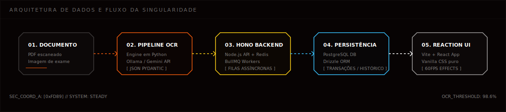

<!-- BANNER ANIMADO DA SINGULARIDADE -->
<p align="center">
  
</p>

<!-- TECH BADGES MINIMALISTAS E HIGH-TECH -->
<p align="center">
  
  
  
  
  
  
  
</p>

---

## Visão Geral

**Singular** é uma plataforma web para geração automatizada de quizzes e exames a partir de documentos (PDFs, imagens e exames escaneados). Utiliza pipelines de OCR e LLM/VLM para extração estruturada de conteúdo, apresentando os resultados em uma interface imersiva baseada em React e Three.js.

---

## Demonstração

Abaixo está uma demonstração em vídeo do funcionamento do ecossistema e de sua interface em tempo real:

<p align="center">
  <video src="https://github.com/user-attachments/assets/021c2bf6-4fed-4eda-addb-9ddb637e6944" width="100%" controls autoplay loop muted playsinline></video>
</p>

---

## Arquitetura e Fluxo de Dados

Abaixo está o mapeamento visual do processamento de um documento bruto até a renderização na interface:

<p align="center">
  
</p>

### Ciclo de Vida do Processamento de Documentos

1. **Upload**: O cliente envia o arquivo (PDF ou imagem) pela interface web.
2. **Recepção e Enfileiramento**: A API backend em Hono recebe o upload, armazena temporariamente o arquivo, persiste os metadados iniciais no banco PostgreSQL via Drizzle ORM e enfileira um job de processamento no Redis.
3. **Consumo e Execução de Tarefa**: O worker de processamento de exames (`process-exam.ts`) consome o job através do BullMQ e faz uma chamada IPC ao script Python da pipeline.
4. **Extração OCR**:
   - **Caso PDF**: O pipeline tenta extrair o texto diretamente usando a biblioteca PyMuPDF. Se não houver texto selecionável, o PDF é convertido para imagens via `pdf2image`.
   - **OCR Multimodal (VLM)**: As imagens são enviadas ao provedor configurado. No modo `local`, o Ollama executa um modelo visual (por padrão `glm-ocr` ou `qwen2.5vl:3b`). No modo `api`, as imagens são enviadas diretamente à API do Google Gemini.
5. **Estruturação de Dados**: O texto bruto extraído é enviado ao modelo da família Gemini (via API) junto com o framework `instructor` para extrair questões, enunciados e alternativas de forma tipada, gerando um payload JSON estruturado sob validação do Pydantic.
6. **Persistência**: O worker recebe o JSON validado e atualiza a base de dados com as questões e alternativas extraídas.
7. **Consumo**: O frontend atualiza a interface via React Query assim que o status da tarefa é concluído, permitindo a visualização e interação imediata.

---

## Arquitetura de Componentes e Tecnologias

A tabela a seguir apresenta os detalhes técnicos de cada módulo do ecossistema:

| Módulo / Componente | Tecnologias Utilizadas | Papel no Sistema |
| :--- | :--- | :--- |
| **Interface do Usuário (Frontend)** | React 19, Vite, Three.js (R3F), Zustand, Framer Motion | SPA otimizada com renderização interativa 3D, controle de estado via Zustand, e estilização nativa baseada em CSS3 Vanilla (Design Tokens). |
| **Servidor de API (Backend)** | Hono, Node.js, TypeScript | API RESTful rápida e modular responsável por gerenciar uploads de arquivos, persistência básica e orquestração de filas. |
| **Orquestração de Filas (Workers)** | BullMQ, Redis, Node.js | Gerenciamento e execução paralela de tarefas assíncronas em segundo plano, divididas entre processamento de exames e classificação de questões. |
| **Engine de Extração (Pipeline)** | Python, Instructor, Pydantic, pdf2image, PyMuPDF | Pipeline Python executado isoladamente para OCR e análise estruturada de documentos brutos em JSON tipado. |
| **Banco de Dados** | PostgreSQL, Drizzle ORM | Persistência de dados relacionais com migrações gerenciadas declarativamente por meio do Drizzle Kit. |
| **Provedores de OCR** | Ollama (GLM-OCR / Qwen), Google Gemini API | Mecanismo de OCR híbrido permitindo comutação entre modelo local privado (custo zero) e nuvem (máxima velocidade e acurácia). |

---

## Como Iniciar

### Pré-requisitos
*   **Node.js** (v18+)
*   **Docker** e **Docker Compose** (para Redis e PostgreSQL)
*   **Python** (v3.10+)

<details>
<summary><b>1. Clonar e Instalar Dependências JavaScript</b></summary>
<br />

Instale as dependências na raiz do projeto e nos sub-projetos:

```bash
# Instale as dependências da raiz (gerenciador de processos simultâneos)
npm install

# Instale as dependências de cada sub-projeto
cd backend && npm install && cd ../frontend && npm install && cd ..
```
</details>

<details>
<summary><b>2. Configurar o Ambiente Python (Pipeline de OCR)</b></summary>
<br />

Crie um ambiente virtual em Python na raiz do projeto e instale as bibliotecas necessárias para extração dos documentos:

```bash
# Crie o ambiente virtual (.venv) na raiz do projeto
python3 -m venv .venv

# Ative o ambiente virtual
# No Linux/macOS:
source .venv/bin/activate
# No Windows:
.venv\Scripts\activate

# Instale as dependências
pip install -r pipeline/requirements.txt
```

> [!NOTE]
> No Linux, o processamento de arquivos PDF (`pdf2image`) depende do utilitário de sistema `poppler`. Caso ocorra algum erro ao processar PDFs, instale-o pelo terminal do sistema:
> *   **Ubuntu/Debian:** `sudo apt-get install poppler-utils`
> *   **macOS:** `brew install poppler`
</details>

<details>
<summary><b>3. Configurar Variáveis de Ambiente</b></summary>
<br />

Copie o arquivo de exemplo de variáveis de ambiente para a raiz do projeto e configure conforme o seu uso:

```bash
cp .env.example .env
```

Abra o arquivo `.env` gerado e configure o modo do provedor de OCR (`OCR_PROVIDER`):
*   **Modo Local (`local`)**: Utiliza o **Ollama** instalado localmente para extração de OCR a custo zero.
*   **Modo API (`api`)**: Utiliza os modelos **Google Gemini** em nuvem (Requer que você insira sua chave `GEMINI_API_KEY`).
</details>

<details>
<summary><b>4. Setup do OCR Local (Opcional - Ollama)</b></summary>
<br />

Caso opte por utilizar o OCR Local gratuito, certifique-se de que o Ollama está rodando e execute o script automatizado para baixar e configurar os modelos recomendados:

```bash
bash scripts/setup-local-ocr.sh
```
*Este script baixará o modelo otimizado `glm-ocr` de alta performance e configurará o seu ambiente local.*
</details>

### Execução do Projeto Completo

Inicie o banco de dados PostgreSQL, o Redis, execute as migrações e rode todos os serviços (API backend, workers e frontend) com um único comando na raiz do projeto:

```bash
npm run all
```

Após o carregamento, os serviços estarão disponíveis em:
*   **Frontend Web**: `http://localhost:5173`
*   **Backend API**: `http://localhost:3001`

---

## Estrutura do Repositório

```path
├── backend/          # Servidor HTTP Hono, esquemas Drizzle e workers BullMQ
├── frontend/         # App React com design tokens e UI interativa
├── pipeline/         # Engine Python OCR para parsing inteligente de exames e documentos
├── scripts/          # Shell scripts utilitários de setup local
├── docs/             # Arquivos de documentação visual e diagramas
│   ├── banner.svg    # Banner da Singularidade
│   └── architecture.svg # Fluxograma do ciclo de vida dos dados
├── docker-compose.yml# Configuração dos contêineres Redis e PostgreSQL
└── .gitignore        # Arquivos protegidos e configs locais ignorados
```

---

## Design System e Estética Visual

A interface do Singular implementa conceitos modernos de UI baseados em pretos absolutos, gradientes profundos, bordas neon sutis e animações espaciais interativas. Todo o design é implementado usando CSS nativo puro para garantir o máximo desempenho de renderização a 60fps, evitando frameworks pesados de estilização.

---

## Licença

Este projeto é de código aberto e está licensed sob os termos da [Licença MIT](LICENSE). Sinta-se livre para usar, estudar, modificar e distribuir o código.
